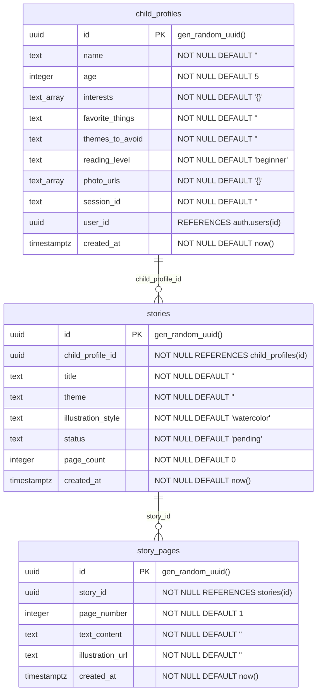

# Database Schema Documentation

## Adventures Of... - AI Children's Storybook Platform

---

## 1. Overview

The database uses Supabase-hosted PostgreSQL with Row Level Security (RLS) enforced on all tables. The schema supports anonymous session-based access for the MVP, with optional authenticated user ownership for future use.

**Database Provider:** Supabase PostgreSQL  
**Access Pattern:** Anonymous session-based (UUID in `x-session-id` header)  
**Migrations:** Applied via Supabase migration tooling  

---

## 2. Schema Diagram



---

## 3. Table Definitions

### 3.1 `child_profiles`

Stores the child's identity and personalization data used to generate stories.

| Column | Type | Nullable | Default | Description |
|--------|------|----------|---------|-------------|
| `id` | uuid | NO | `gen_random_uuid()` | Primary key |
| `name` | text | NO | `''` | Child's first name |
| `age` | integer | NO | `5` | Child's age (3-7) |
| `interests` | text[] | NO | `'{}'` | Array of interest strings (max 5) |
| `favorite_things` | text | NO | `''` | Free-text: color, animal, food |
| `themes_to_avoid` | text | NO | `''` | Content to exclude from stories |
| `reading_level` | text | NO | `'beginner'` | `beginner` or `intermediate` |
| `photo_urls` | text[] | NO | `'{}'` | Public URLs to uploaded photos |
| `session_id` | text | NO | `''` | Anonymous session UUID |
| `user_id` | uuid | YES | `NULL` | Optional FK to `auth.users` |
| `created_at` | timestamptz | NO | `now()` | Record creation time |

**Constraints:**
- Primary Key: `id`
- Foreign Key: `user_id` -> `auth.users(id)`

**Valid Values:**
- `reading_level`: `'beginner'`, `'intermediate'`
- `age`: 3-7 (enforced client-side only)
- `interests`: up to 5 items from: Space, Animals, Princesses, Superheroes, Cars & Trucks, Fairies & Magic, Sports, Music, Robots, Art & Drawing (enforced client-side only)

---

### 3.2 `stories`

Tracks story generation requests and their completion status.

| Column | Type | Nullable | Default | Description |
|--------|------|----------|---------|-------------|
| `id` | uuid | NO | `gen_random_uuid()` | Primary key |
| `child_profile_id` | uuid | NO | - | FK to child_profiles |
| `title` | text | NO | `''` | AI-generated story title |
| `theme` | text | NO | `''` | Selected theme identifier |
| `illustration_style` | text | NO | `'watercolor'` | Selected style identifier |
| `status` | text | NO | `'pending'` | Generation pipeline status |
| `page_count` | integer | NO | `0` | Number of generated pages |
| `created_at` | timestamptz | NO | `now()` | Record creation time |

**Constraints:**
- Primary Key: `id`
- Foreign Key: `child_profile_id` -> `child_profiles(id)`

**Valid Values:**
- `theme`: `'superhero'`, `'fairy-tale'`
- `illustration_style`: `'watercolor'`, `'cartoon'`, `'storybook'`
- `status`: `'pending'`, `'generating'`, `'complete'`, `'failed'`

**Status State Machine:**
```
pending -> generating -> complete
pending -> generating -> failed
```

---

### 3.3 `story_pages`

Stores individual pages of generated stories with text and illustration URLs.

| Column | Type | Nullable | Default | Description |
|--------|------|----------|---------|-------------|
| `id` | uuid | NO | `gen_random_uuid()` | Primary key |
| `story_id` | uuid | NO | - | FK to stories |
| `page_number` | integer | NO | `1` | Page position (1-8) |
| `text_content` | text | NO | `''` | Story text for this page |
| `illustration_url` | text | NO | `''` | URL to illustration image |
| `created_at` | timestamptz | NO | `now()` | Record creation time |

**Constraints:**
- Primary Key: `id`
- Foreign Key: `story_id` -> `stories(id)`

**Typical Record Count:** 8 per story (one per page)

---

## 4. Indexes

| Index Name | Table | Column(s) | Purpose |
|------------|-------|-----------|---------|
| `idx_child_profiles_session_id` | child_profiles | `session_id` | Fast lookup by anonymous session |
| `idx_child_profiles_user_id` | child_profiles | `user_id` | Fast lookup by authenticated user |
| `idx_stories_child_profile_id` | stories | `child_profile_id` | Join performance |
| `idx_stories_status` | stories | `status` | Polling queries filter by status |
| `idx_story_pages_story_id` | story_pages | `story_id` | Fast page retrieval |
| `idx_story_pages_page_number` | story_pages | `(story_id, page_number)` | Composite for ordered retrieval |

---

## 5. Row Level Security (RLS) Policies

### 5.1 `child_profiles`

| Policy Name | Operation | Condition |
|-------------|-----------|-----------|
| "Users can read own profiles by session" | SELECT | `session_id` matches header OR `auth.uid() = user_id` |
| "Anyone can create a child profile" | INSERT | `WITH CHECK (true)` -- open for demo |
| "Users can update own profiles by session" | UPDATE | `session_id` matches header OR `auth.uid() = user_id` |

**Session Matching Expression:**
```sql
session_id = current_setting('request.headers', true)::json->>'x-session-id'
```

### 5.2 `stories`

| Policy Name | Operation | Condition |
|-------------|-----------|-----------|
| "Users can read own stories" | SELECT | Exists: child_profiles with matching session/user |
| "Anyone can create a story" | INSERT | Exists: child_profiles with matching session/user |
| "Users can update own stories" | UPDATE | Exists: child_profiles with matching session/user |

**Join Pattern (used for all story policies):**
```sql
EXISTS (
  SELECT 1 FROM child_profiles cp
  WHERE cp.id = stories.child_profile_id
  AND (cp.session_id = current_setting('request.headers', true)::json->>'x-session-id'
    OR (auth.uid() IS NOT NULL AND auth.uid() = cp.user_id))
)
```

### 5.3 `story_pages`

| Policy Name | Operation | Condition |
|-------------|-----------|-----------|
| "Users can read own story pages" | SELECT | Exists: stories + child_profiles with matching session/user |
| "Anyone can insert story pages" | INSERT | Exists: stories + child_profiles with matching session/user |

**Join Pattern (double join through stories):**
```sql
EXISTS (
  SELECT 1 FROM stories s
  JOIN child_profiles cp ON cp.id = s.child_profile_id
  WHERE s.id = story_pages.story_id
  AND (cp.session_id = current_setting('request.headers', true)::json->>'x-session-id'
    OR (auth.uid() IS NOT NULL AND auth.uid() = cp.user_id))
)
```

---

## 6. Storage Buckets

### 6.1 `child-photos`

| Property | Value |
|----------|-------|
| Bucket ID | `child-photos` |
| Public | Yes |
| Purpose | Store uploaded child photos for AI processing |

**Storage Policies:**

| Policy | Operation | Condition |
|--------|-----------|-----------|
| "Anyone can upload photos" | INSERT | `bucket_id = 'child-photos'` |
| "Anyone can read photos" | SELECT | `bucket_id = 'child-photos'` |

**File Path Convention:**
```
{session_id}/{random_uuid}.{extension}
```

**Example:** `a1b2c3d4-e5f6-7890-abcd-ef1234567890/f47ac10b-58cc-4372-a567-0e02b2c3d479.jpg`

---

## 7. Data Flow Patterns

### 7.1 Write Path (Story Creation)

```
1. Client INSERTs child_profiles (returns id)
2. Client INSERTs stories with child_profile_id (returns id)
3. Edge function UPDATEs stories.status to 'generating'
4. Edge function INSERTs 8 story_pages records
5. Edge function UPDATEs stories.status to 'complete' + page_count
```

### 7.2 Read Path (Story Viewing)

```
1. Client SELECTs stories WHERE id = :storyId (single record)
2. Client SELECTs story_pages WHERE story_id = :storyId ORDER BY page_number
```

### 7.3 Polling Path (During Generation)

```
Client SELECTs stories.status WHERE id = :storyId (every 2 seconds)
```

---

## 8. Edge Function Database Access

The edge function uses `SUPABASE_SERVICE_ROLE_KEY` which bypasses RLS. It performs:

| Operation | Table | Purpose |
|-----------|-------|---------|
| UPDATE | stories | Set status to 'generating' |
| UPDATE | stories | Set title during generation |
| INSERT | story_pages | Save 8 page records |
| UPDATE | stories | Set status to 'complete' + page_count |

---

## 9. Migration History

| Timestamp | Filename | Description |
|-----------|----------|-------------|
| 20260518195551 | create_story_tables | Core schema: child_profiles, stories, story_pages + RLS + indexes |
| 20260518203954 | create_photo_storage_bucket | Storage bucket: child-photos with public access |

---

## 10. Data Retention & Cleanup

**Current State:** No cleanup is implemented.

| Data | Retention | Notes |
|------|-----------|-------|
| child_profiles | Indefinite | Never deleted |
| stories | Indefinite | Never deleted |
| story_pages | Indefinite | Never deleted |
| child-photos (storage) | Indefinite | No TTL, no orphan cleanup |

**Recommendations:**
- Add TTL-based cleanup for sessions older than 30 days
- Implement storage lifecycle rules for unused photos
- Add soft-delete for GDPR compliance readiness

---

## 11. Query Examples

### Fetch a complete story with pages:
```sql
SELECT s.*, 
       json_agg(sp ORDER BY sp.page_number) as pages
FROM stories s
LEFT JOIN story_pages sp ON sp.story_id = s.id
WHERE s.id = :story_id
GROUP BY s.id;
```

### Check story generation status:
```sql
SELECT status FROM stories WHERE id = :story_id;
```

### Get all stories for a session:
```sql
SELECT s.* FROM stories s
JOIN child_profiles cp ON cp.id = s.child_profile_id
WHERE cp.session_id = :session_id
ORDER BY s.created_at DESC;
```

### Count stories by status (analytics):
```sql
SELECT status, count(*) FROM stories GROUP BY status;
```
