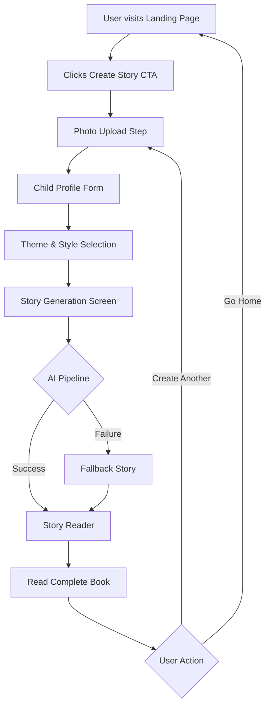
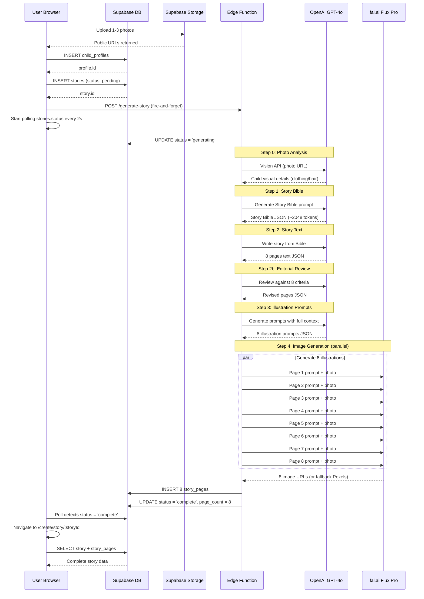
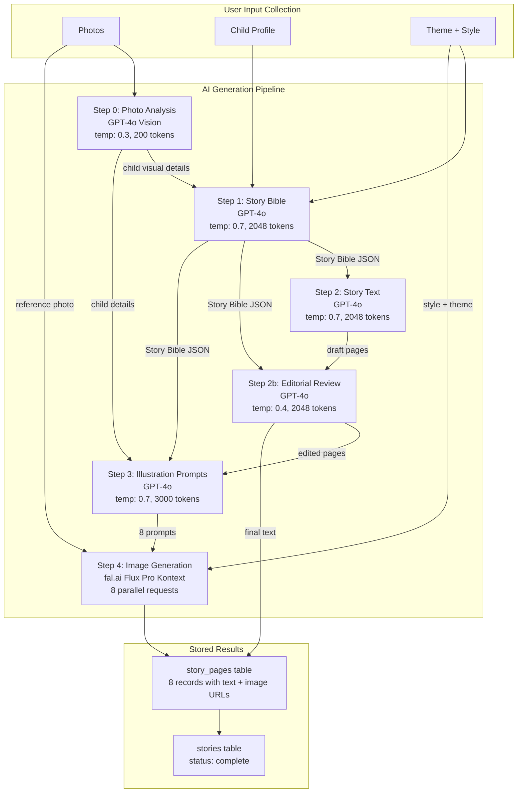
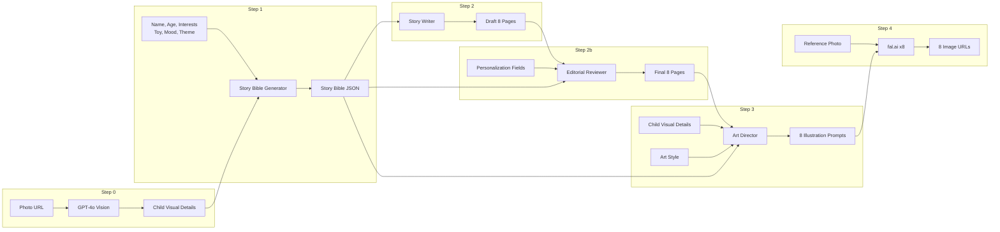
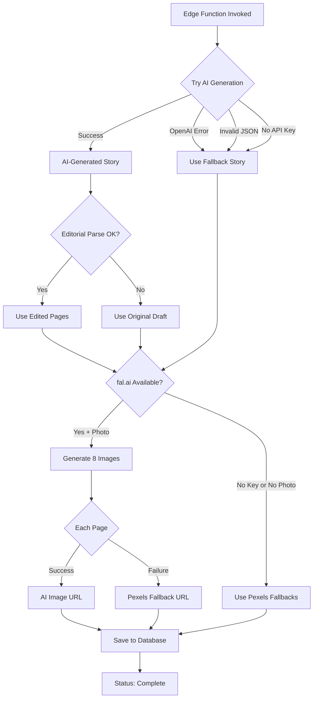
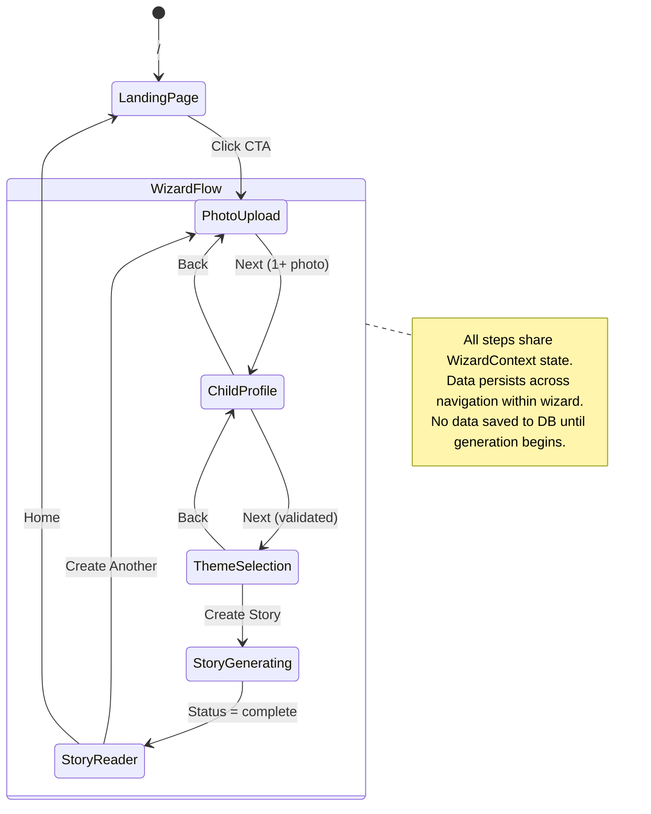
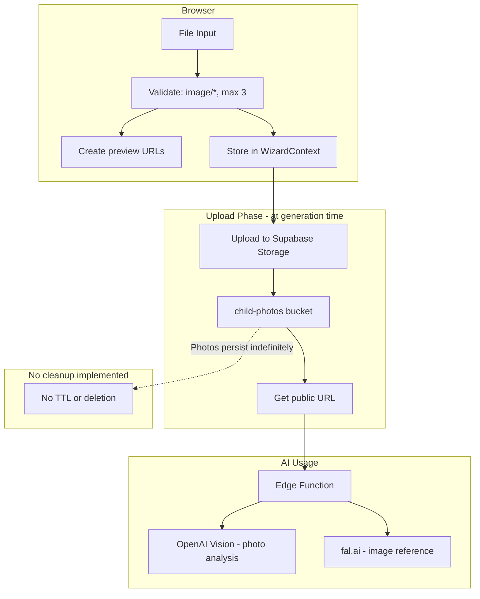
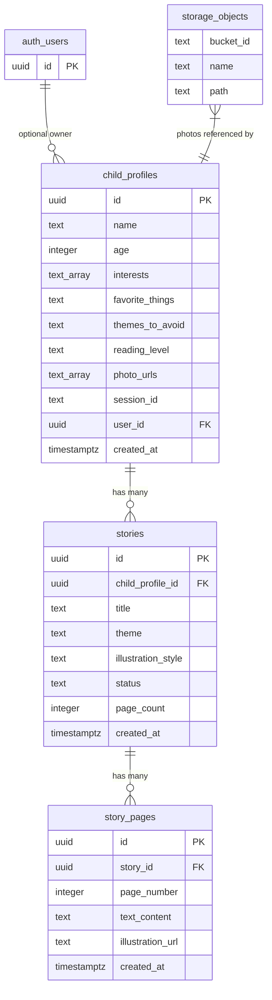
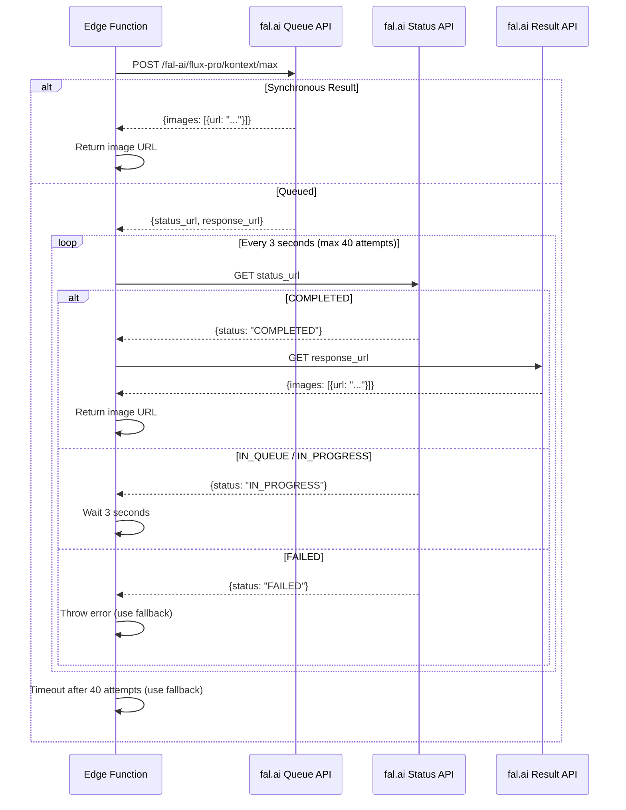
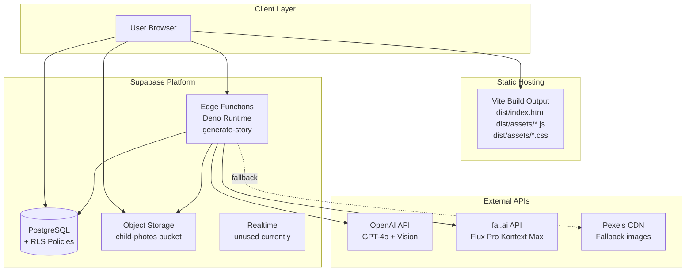

# System Flow Diagrams

## Adventures Of... - AI Children's Storybook Platform

---

## 1. End-to-End User Journey

---

## 2. Story Generation - Detailed Sequence

---

## 3. AI Pipeline - Internal Flow

---

## 4. Data Flow - Context Passing

---

## 5. Failure & Fallback Flow

---

## 6. Frontend Routing & State

---

## 7. Storage & File Handling

---

## 8. Database Entity Relationship

---

## 9. fal.ai Image Generation - Polling Flow

---

## 10. Deployment Architecture

